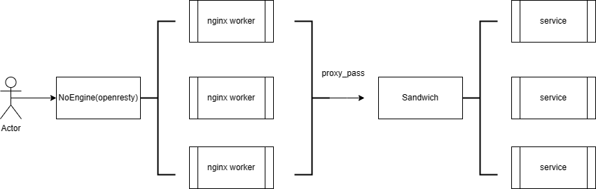
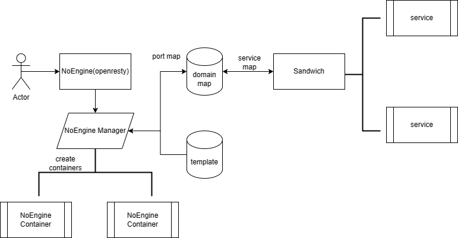

# NoEngine架构设计变更

## 变更原因
在最开始的架构设计中，使用NoEngine服务(即openresty容器)作为整个集群的入口

在NoEngine的`nginx.conf`配置文件中需要根据微服务配置每一个微服务的反向代理配置文件

最终NoEngine的配置文件结构如下:
```bash
- conf
  - nginx.conf
- conf.d
  - app1.conf  
  - app2.conf
  ...
```
配置文件重复性高，且每个服务都需要单独编写静态代理的目录和`proxy_pass`的后端微服务

**缺点**
- 变更微服务时，修改对应微服务的配置文件后需要重启整个NoEngine来重新加载
- 针对每个服务是否https转发都需要配置一遍ssl证书
- 想要实现动态的端口转发比较复杂，不少后端服务的proxy_pass都需要写死在配置文件中，不方便后期维护

## 变更历史

- [NoEngineNG Commit](https://github.com/JJApplication/NoEngineNG/commit/00c76331b67b6732fa6c53199630c4ced8d8cf9d)
- [Sandwich Commit](https://github.com/JJApplication/Sandwich/commit/db7b0c16c5899db6e79eb468fb0824051d580192)
- [Apollo Commit](https://github.com/JJApplication/Apollo/commit/cec28332499c76a7d1e969cd09049cea64a1fc95)
- [ApolloUI Commit](https://github.com/JJApplication/ApolloUI/commit/a456479f5cf7158edbf1e399bc1709ec934e7cf3)
- [octopusTree Commit](https://github.com/JJApplication/octopusTree/commit/fcd8a8616f14eb7dcc37631a2c03e7b303135cf5)

为简化前端服务的静态代理和后端服务的代理转发步骤

达到服务无需关注自身监听端口，只需关注自己绑定的域名的目的

从以下几个方面重新设计了`NoEngine`和`Sandwich`

### NoEngine变更
- 抽象出NoEngine入口和NoEngineAPP概念，分别代表全局的流量入口和每个独立的前端服务
- 抽象出域名服务映射结构，将域名和微服务的前后端服务分别映射
- 抽象出NoEngineAPP模板，通过统一的配置模板可以快速生成前端微服务的容器
- 所有NoEngineAPP都将转发后端请求到`Sandwich`网关，由网关将流量进行分配转发到对应的后端服务

### Sandwich变更
- 重新设计域名解析逻辑，将域名流量分为前端和后端服务转发
- 转发后端服务时，通过特殊的本地转发请求头来与前端流量进行区分
- 从配置中读取域名服务映射表

## 架构设计

**AS IS**



NoEngine上存储了所有前端服务的配置文件，并根据`proxy_pass`配置的不同端口，转发到不同的后端服务

**TO BE**



NoEngine只监听`80`和`443`端口，分别代理http和https流量

前端服务通过`NoEngineAPP Template`模板来生成对应的nginx容器，端口动态生成存储在**端口域名映射表中**

所有前端服务的nginx代理转发`proxy_pass`都转发到Sandwich网关，由网关通过域名映射表来转发到具体的后端服务

### NoEngineTemplate

每一个NoEngineAPP容器由两个配置组成`app.conf`, `noengine.cf.json`

`app.conf`即统一的nginx配置文件， 统一监听在容器内部的80端口
```bash
server {
  listen 80;
  server_name _;
  location / {
          proxy_set_header Remote-Host $remote_addr;
          proxy_set_header X-Real-IP $remote_addr;
          proxy_set_header Host $host;
          # 标识内部网关请求
          proxy_set_header X-Gateway-Local "yes";
          # 标识微服务
          proxy_set_header X-Gateway-App "Apollo";
          proxy_buffering off;
          proxy_pass http://proxy;
  }
}
```
> 如果存在静态代理配置，配置对应的`root`路径和`index`即可
> 否则直接通过`proxy_pass`转发到Sandwich对应的upstream上

**代理转发的标识请求头**

`X-Gateway-Local` 标识这是一个内部网关的请求，会被转发到后端服务

`X-Gateway-App` 标识要转到的后端微服务名称

----
`noengine.cf.json`即容器配置模板
```json
{
  "serverDomain": "",
  "serverName": "Apollo",
  "volumes": [
    {
      "hostPath": "@root/app.conf",
      "innerPath": "/app.conf"
    },
    {
      "hostPath": "?/renj.io/ssl",
      "innerPath": "/ssl"
    }
  ],
  "ports": [
    {
      "hostPort": "",
      "innerPort": "80",
      "proto": "tcp"
    }
  ]
}
```

`serverName`标识了此NoEngineAPP的名称，此服务名是独立于JJAPP服务名称的

`volumes`是需要挂载到容器内的宿主机路径，默认包含
- 前端服务的根目录即`@app`
- NoEngineAPP的配置文件路径即`@root/app.conf`
- ssl证书目录

`ports`是需要监听的端口组，默认只需要监听容器内的80端口

宿主机端口`hostPort`在缺省时由manager动态生成


> 内置环境变量解析
> 
> @root 即NoEngineAPP的根目录->$NoEngine/$APP
> 
> @app 即JJAPP微服务的根目录->$APP_ROOT/$APP
>
> ? 即绝对路径标识符，后面的路径会被解析为绝对路径

----

全局配置文件`nginx.conf`

所有的NoEngineAPP容器都会挂载的配置文件
```bash
http {
    # proxy server
    upstream proxy {
        server 127.0.0.1:8888;
    }

    # http监听所有支持的域名
    server {
      listen 80;
      server_name your_domain_list;
      if ($host == xxx){
          rewrite ^(.*)$ https://$host$1 permanent;
      }
      location / {
              proxy_pass http://proxy;
      }
    }
    server {
      listen 443;
      server_name your_domain_list;
      location / {
              proxy_pass http://proxy;
      }
    }
}
```

`upstream`定义了Sandwich网关的地址

监听80和443端口的流量并全部转发到Sandwich网关

### NoEngineDomain

抽象的域名微服务映射表，用于网关确定要转发的服务

```json
{
  "domain_name": {
    "frontend": "ServiceName",
    "backend": "ServiceName"
  }
}
```

一个域名可以对应一个前端服务`frontend`和一个后端服务`backend`

在Sandwich处理流量转发时可以根据域名映射`NoEngineDomainMap`来确定要转发到的前端NoEngineAPP服务

根据`X-Gateway-App`请求头确定要转发到的后端服务

### NoEngineAppMap

前端服务的端口映射表

```json
{
  "ServiceName": "Port"
}
```
记录了通过模板创建的容器监听的端口， `Sandwich`在解析前端请求会转发到对应的容器端口

### 内部微服务转发
`DomainReflect`后端服务的端口映射表，由`Apollo`服务在启动微服务时动态生成并存储在mongo中

```json
{
  "ServiceName": "Port"
}
```

在`Sandwich`通过内部网关头部`X-Gateway-App`获取到要转到的后端服务后，通过查询此映射表来转到对应的服务端口
## 后期计划

当前的请求调用链需要经过三次转发

```bash
NoEngine -> Sandwich -> Service
```

为提高效率，方便流量的统计和监控，后期计划将`NoEngine`和`Sandwich`服务优化为`RainbowBridge`网关

参考service-mesh的架构设计，将调用链简化为
```bash
RainbowBridge -> Service
```

### 统一的配置中心
当前的前端和后端服务的域名信息与端口信息分别记录在不同的服务下

与微服务状态耦合性较高

后期会由独立的全局配置中心来记录多服务间共享的配置信息